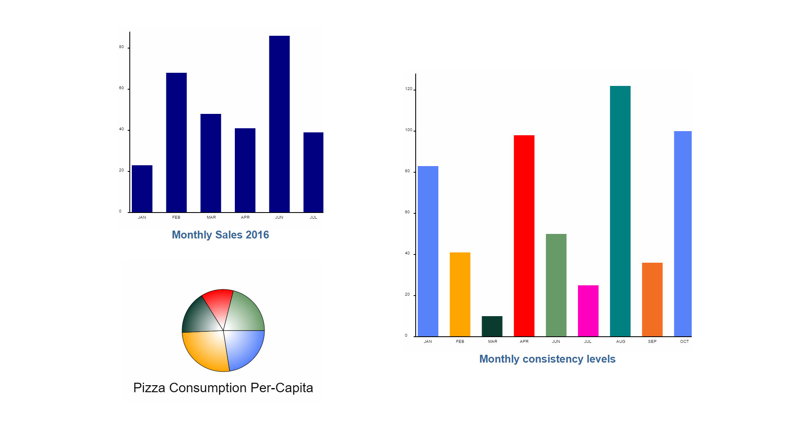

# Canvas-Component-Angular2
Explores the use of the Canvas API in an Angular2 app

## Basic Usage

- Angular2 Canvas



## Install
```
npm install
```
## Run the project

```
npm start
```
Browse to http://localhost:3002
